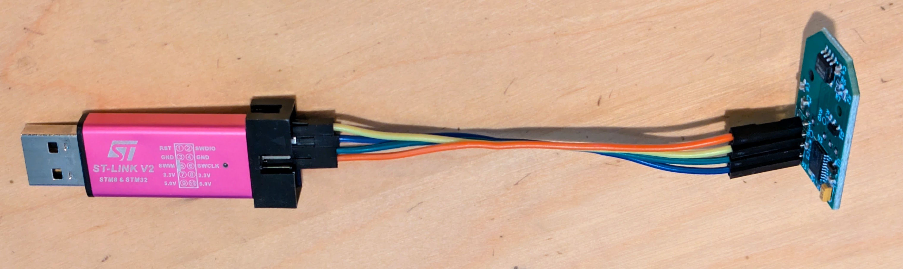

# 
Magnetic Encoder Dummy Servo Firmware

The firmware implements the Dynamixel protocol to emulate a FeeTech servo. It reads the magnetic encoder and also supports writing configurations to EEPROM.

The firmware is developed in Visual Studio Code with the PlatformIO extension. The firmware is based on the Arduino framework.

### Drivers

Arduino drivers are blocking. They contain busy loops that wait while the sensor is being read. The Dynamixel protocol which is used to control the FeeTech servos times out if there is no immediate response upon a communication request. For this reason custom, non blocking drivers for the I2C / SPI peripherals as well as the magnetic encoders have to be implemented.

## Programming

The GD32F130 is programmed with a ST-LINK V2 dongle: https://www.aliexpress.us/item/3256805941217455.html / https://www.aliexpress.us/item/3256805308308820.html

The CH32V003  is programmed with a WCH-linkE dongle: https://www.aliexpress.us/item/3256804084637506.html

The PCB has holes for a programming header, but that does not need to be populated. It is usually possible to just loosely insert the connectors and press them sideways with a finger while programming to make good enough contact.

**The programming header has a 3.3V pin. That 3.3V should only be connected if there is no voltage on the servo com headers!**

