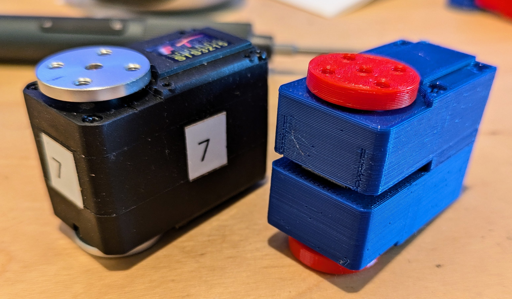
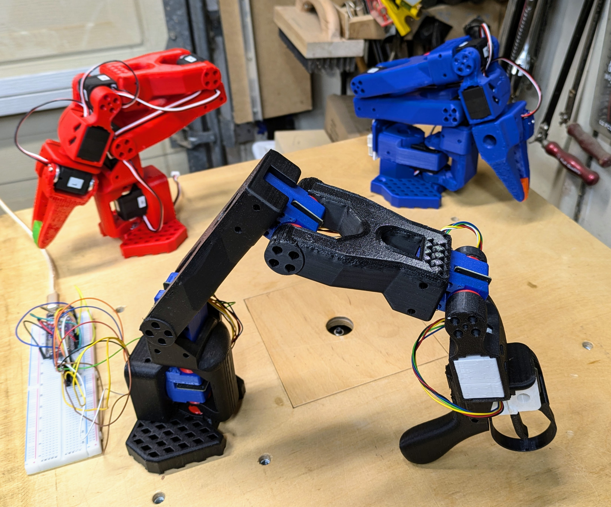
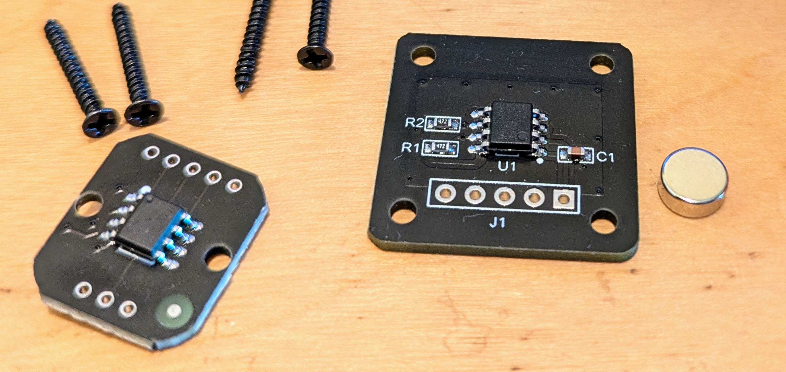
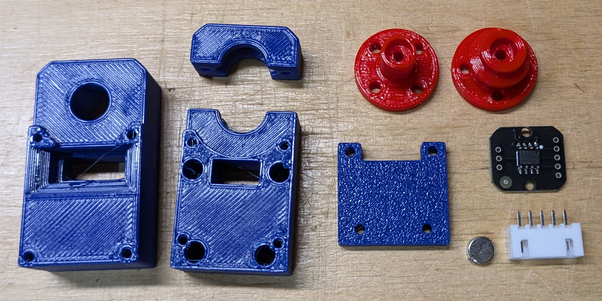
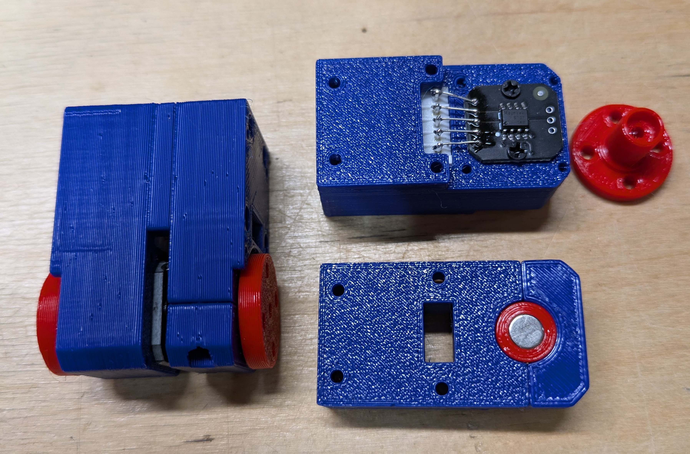
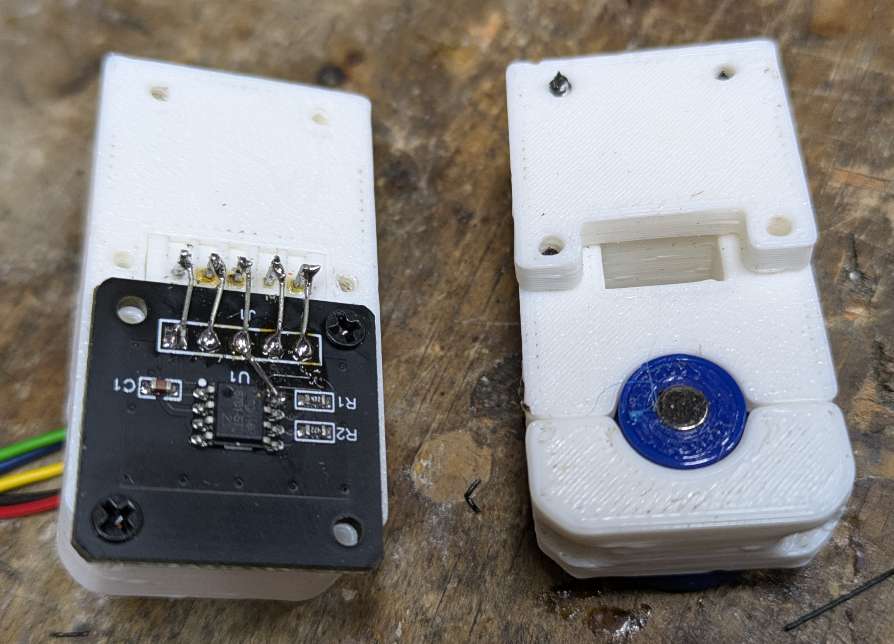
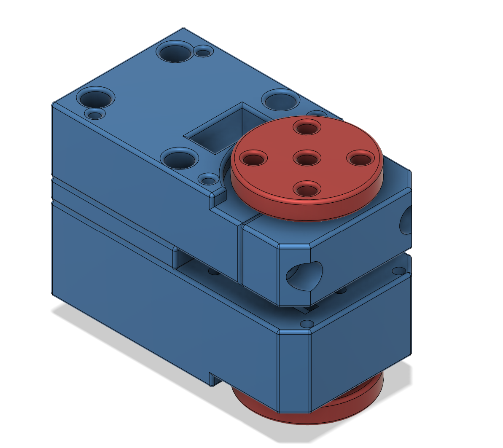

# 
Magnetic Encoder Dummy Servo

## Summary
This project is related to 
https://github.com/huggingface/lerobot
and
https://github.com/TheRobotStudio/SO-ARM100

It explores to use much cheaper magnetic encoders for the Leader Arm instead of the servos currently used.

## Hardware

### Magnetic Rotary Encoders
Currently there are two cheap and popular magnetic encoders on AliExpress, the AS5600 MT6701.
The AS5600 is older, 12 bit and supports only I2C. Since the chip has only one hard coded ID, that makes it hard to use when many of them are needed.
The MT6701 has 14 bit resolution and also supports a SSI interface, which is similar to SPI.

AliExpress offers several MT6701 breakout boards some of which can be purchased in low quantities for less than $2 including magnet.

[AliExp MT6701](https://www.aliexpress.com/w/wholesale-MT6701.html)

The larger version only has the I2C pins on the header and must be modified to work with SSI. One trace needs to be cut, one pin lifted and connected to the header. It is also slightly too large, sticking out a bit in front of the servo. It can be made to work, but the smaller board is much easier to use and therefor recommended. However the smaller board does not come with magnets. They must be purchased separately. Only radially magnetized magnets can be used. Normally disk magnets are magnetized axially. 

[AliExp Radial Magnets](https://www.aliexpress.us/item/3256804628068823.html)

### 3D Printed Servo Housing

There are two slightly different versions of the housing. The simple version does not retain the servo horns by itself. It relies on the structure of the robot arm to keep them in place. This version is slightly simpler and is used for the lower 4 arm servos.

The wrist and gripper need the horn to be held in place by the servo itself. For these joints the top is split into two parts and the horn axle is not just a straight cylinder.

**Big Board Alternative**

The [Dummy Servo](./Hardware) is 3D printed.

## Software

A simple [Arduino](./Arduino) / PlatformIO project is used to read the six encoders and send their values over a serial USB port to the PC.

On the PC side a small [Python](./Python) program receives the values from the serial port and uses the Feetech-SDK to control the servos of the follower arm.

