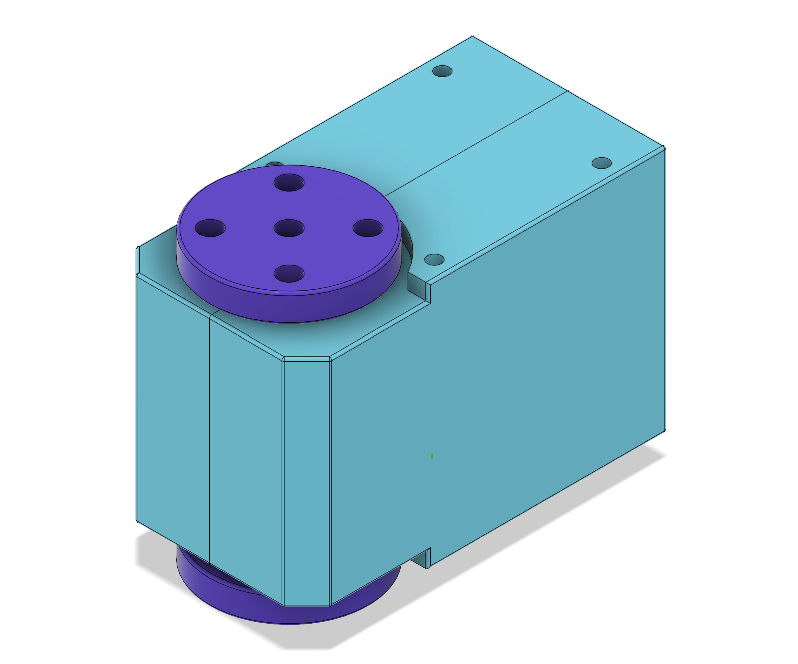

# 
Magnetic Encoder Dummy Servo

## Summary
This project is related to 
https://github.com/huggingface/lerobot
and
https://github.com/TheRobotStudio/SO-ARM100

It explores to use much cheaper magnetic encoders for the Leader Arm instead of the regular servos. These dummy servos are also much easier to move manually, as there is no gear train that needs to back drive the servo motor. This makes them ideal for the Leader Arm.

## Custom PCB

The custom PCB makes it possible to daisy chain magnetic encoders for much easier wiring. The PCB uses a microcontroller that emulates a FeeTech servo. The dummy servos can be connected to the same servo controller board and no special software is needed.

### Manufacturing
TODO: JLCPCB

### Cables and Connectors

FeeTech servos use 3-pin 5264 connectors. However, JST XH connectors are more common and pre-made cables are much easier to find. The PCB can be populated with either of the connector types. If JST connectors are used, an adapter needs to be made to connect to the 5264 connector on the controller board. Alternatively one can simply cut off one end from a pre-made cable and solder it directly to the controller board.

The dummy servos use very little current. So any gauge wire should be ok. However, if they are to be mixed with real servos on the same bus, wire gauge needs to be taken into consideration.

The servos use "reverse double head" cables (pin 1 connected to pin 1, etc.) although in a pinch it's also possible to switch the terminals on "same side' cables yourself.

JST XH: https://www.aliexpress.us/w/wholesale-JST-XH-3.html
JST XH cables: https://www.aliexpress.us/w/wholesale-xh-double-head.html

5264: https://www.aliexpress.us/w/wholesale-5264.html
5264 cables: https://www.aliexpress.us/w/wholesale-5264-double-head.html https://www.aliexpress.us/item/3256806128255434.html

### Magnets

Normally magnetic encoders use special, radially magnetized magnets.

Magnets https://www.aliexpress.us/w/wholesale-encoder-magnets.htm

However, it is also possible to use the regular, axially magnetized 6x3 disk magnets which are cheaper. They just have to be oriented sideways. Print the corresponding servo horn instead. N35 magnets are fine. Nothing fancy is needed.

https://www.amazon.com/s?k=6x3mm+magnet
https://www.aliexpress.us/w/wholesale-6x3-magnet.html

### Firmware Programming

See: [Firmware](Firmware)

### 3D Printed Servo Housing

 

## Off the Shelve Hardware

Instead of using a custom PCB it is also possible to use off the shelve parts. This requires more hand wiring.

### Magnetic Rotary Encoders
Currently there are two cheap and popular magnetic encoders on AliExpress, the AS5600 and the MT6701.
The AS5600 is older, has 12 bit resolution (4096) and supports only I2C. Since the chip has only one hard coded ID, that makes it hard to use when multiple of them are needed.
The MT6701 has 14 bit resolution (16,383) and also supports a SSI interface, which is similar to SPI.

AliExpress offers several MT6701 breakout boards some of which can be purchased in low quantities for less than $2 including magnet.

[AliExp MT6701](https://www.aliexpress.com/w/wholesale-MT6701.html)

The larger version only has the I2C pins on the header and must be modified to work with SSI. The trace to the middle pin of the header needs to be cut and IC pin 8 lifted and connected to that header pin instead. It is also slightly too large, sticking out a bit in front of the servo. It can be made to work, but the smaller board is much easier to use and therefor recommended. However the smaller board does not come with magnets. They must be purchased separately. Only radially magnetized magnets can be used. Normally disk magnets are magnetized axially. 

[AliExp Radial Magnets](https://www.aliexpress.us/item/3256804628068823.html)

### 3D Printed Servo Housing

There are two slightly different versions of the housing. The simple version does not retain the servo horns by itself. It relies on the structure of the robot arm to keep them in place. This version is slightly simpler and is used for the lower 4 arm servos.

The wrist and gripper need the horn to be held in place by the servo itself. For these joints the top is split into two parts and the horn axle is not just a straight cylinder.

**Big Board Alternative**

The [Dummy Servo](./Hardware) is 3D printed.

## Software

A simple [Arduino](./Arduino) / PlatformIO project is used to read the six encoders and send their values over a serial USB port to the PC.

On the PC side a small [Python](./Python) program receives the values from the serial port and uses the Feetech-SDK to control the servos of the follower arm.

